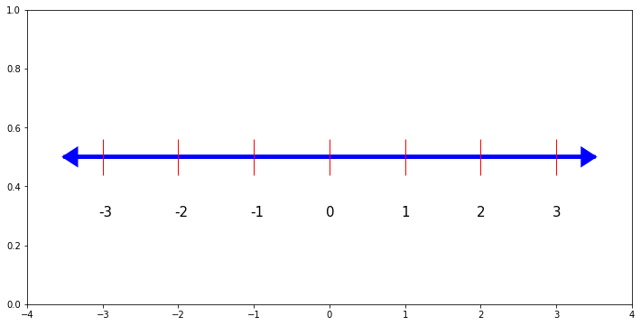

<a href="https://colab.research.google.com/github/kalz2q/mycolabnotebooks/blob/master/numberline.ipynb" target="_parent"></a>

# メモ

1. `colab`で`matplotlib`で、数字線`number line`を作る。
1. ノートブック`ipynb`をマークダウン`md`に変換して、はてななどに貼り付ける。
1. 画像の処理はどうするか。どうなるか。


```
import matplotlib.pyplot as plt
import numpy as np

ax=plt.figure(figsize=(12,6)).add_subplot(xlim=(-4,4), ylim=(0, 1.0))

plt.arrow(-3.5, 0.5, 7, 0, head_width=0.05, head_length=0.15, linewidth=4, color='b', length_includes_head=True)
plt.arrow(3.5, 0.5, -7, 0, head_width=0.05, head_length=0.15, linewidth=4, color='b', length_includes_head=True)

x = [-3, -2, -1, 0, 1, 2, 3]
y = [0.5, 0.5, 0.5, 0.5, 0.5, 0.5, 0.5]
data_name = ["-3", "-2", "-1", "0", "1", "2", "3"]
plt.plot(x, y, 'r|', ms="40")

for (i, j, name) in zip (x, y, data_name) :
    plt.text(i, j, name, fontsize=15, position=(i-0.05, j-0.2))

plt.show()
```




